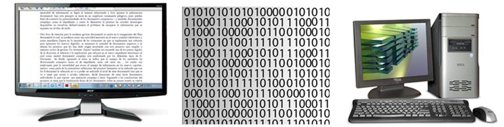
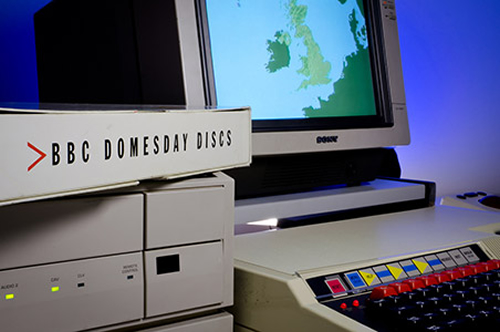

# [ver online](https://nicolasvenegas.github.io/curatorial2024/)
# [Obstrucciones](https://nicolasvenegas.github.io/curatorial2024/page-obstrucciones.html)
# [participantes](https://nicolasvenegas.github.io/curatorial2024/page-perfiles.html)

# Editorialidad y Obsolescencia
## diseño como táctica de corto plazo para problemas estratégicos de largo plazo<sup>1</sup> 



## Estructura / Contenido / Contexto


					
### Lógica
(software > 5 - 10 años)<br/>
≠<br/>
### Física
(hardware > 10 - 20 años)

<hr/>

### Lógica <br/>
(derivas lingüísticas > 30/100 - 10.000 años)<br/>
≠<br/>
### Física <br/>
(acidez > 1 - 4.000 años)

<hr/>


<hr/>

### Domésticas privativas 
≠ 
### Estándares abiertos

<hr/>

## ¿Qué impactos históricos sobre la preservación digital tendrán las domésticas documentales que hoy desplegamos? <sup>2</sup>

### archive.org


### BBC Domesday (1986)


### ImMemory, Chris Marker (1997)


## Posibilidades
1. Preservación de la tecnología > *congelamiento de la técnica* > **obsolescencia planificada**
2. Migración digital > *cambio de medio físico/lógico* > **obsolescencia imprevisible**
3. Compatibilidad privativa retroactiva > *longitudinalidad lógica/física* > **obsolescencia integrada**
4. Formatos estándar > *autonomía lógica/física* (?) > **editorialidad transhistórica**

### Dependencias
¿qué **debe mantener** un documento orientado a la editabilidad?
¿qué **debe perder** un documento con estatuto de autenticidad?

### Caso: Pre-prensa Digital
#### Editorialidad Transhistórica
**markdown** > *lenguaje de marcado* ligero <br/>
**pandoc** > *software libre* y *código abierto*

```
# titulo nivel 1
## titulo nivel 2
### titulo nivel 3
#### titulo nivel 4
##### titulo nivel 5
###### titulo nivel 6
párrafos (solo hacer un salto de linea)
**negritas**
_cursivas_
> cita
- lista desordenada
1. lista numerada
  1. lista anidada

[texto del link](direccion del link)
```

## Proyecto de Diseño

### Jerarquía 
≠ 
### Apariencia

<hr/>

### Diseño
≠ 
### Lujo

<hr/>

### Diseño
≠ 
### Decoración

<hr/>

### Descomposición
> _"No se trata solo del proyecto gráfico de la cubierta de un libro o de una colección de libros, sino también el del propio libro como objeto y, por tanto, del formato, el tipo de papel, el color de la tinta en relación con el color del papel, la encuadernación, la elección de la tipografía según el argumento del libro, la definición de la caja del texto en relación con la página, la colocación de la numeración de las páginas, los márgenes, el carácter visual de las ilustraciones o las fotografías que acompañan al texto, etc."_ <sup>3</sup>

### Recomposición y Conciliación	
recopilación y análisis de información que deviene en decisiones de aproximaciones **funcionales**, **materiales**, **psicológicas**, **ergonómicas**, **estructurales**, **económicas** y **formales**

<hr/>

### La creatividad como _procedimientos de experimentación informada_, desde los materiales y los instrumentos

<hr/>

### Previsualización
Elaboración de dibujos, esquemas constructivos, maquetas y/o prototipos

### Simplificaciones posibles
¿Son posibles disminuciones en materiales, tecnologías, costos asociados, tiempo de trabajo requerido, elementos, tareas de montaje, postprocesos o terminaciones?

### Coherencia formal de la propuesta
#### isomorfa, homeomorfa, catamorfa
¿se parece a un conjunto de ladrillos, a un juego de platos, a las hojas de un árbol?

### Caso: un libro ilegible
> _"Normalmente los libros se hacen con pocos tipos de papel y se encuadernan solo de dos o tres formas distintas. El papel se utiliza como soporte del texto y de las ilustraciones, y no como sujeto “comunicante” de algo. Si se quieren experimentar las posibilidades de comunicación visual de los materiales con los que se confecciona un libro, entonces habrá que hacer pruebas con todos los tipos de papel y formatos, distintas encuadernaciones, troquelados, secuencias de formas (de hojas), papeles de diferentes materiales, con sus colores naturales y sus texturas."_

## Herramientas usadas
1. [Reveal.js](https://revealjs.com/) para la estructura
2. [Markdown](https://daringfireball.net/) para el marcado de contenido
3. [Firefox](https://www.mozilla.org/es-CL/firefox/new/) para el contexto de visualización
4. [Markdown Editor](https://jbt.github.io/markdown-editor/) para consolidación jerarquizada de contenidos
5. bloc de notas (o cualquier editor de texto plano)
6. [Editor markdown](https://jbt.github.io/markdown-editor/)
7. [Google Drive](https://drive.google.com)

## Notas y Bibliografía
1. [The Digital Preservation Management Workshops](https://dpworkshop.org/dpm-eng/workshops/fiveday.html)
2. [Proyecto BBC Domesday](https://es.wikibrief.org/wiki/BBC_Domesday_Project)
3. [Cómo nacen los objetos, Bruno Munari](https://drive.google.com/file/d/1S_uA80-0v_LmDII1pOk2hCX63crjqDl-/view?usp=sharing)
4. [Gestión de los documentos digitales: estrategias para su conservación, Jordi Serra](https://drive.google.com/file/d/1fJ1mgoI78fuAQBdhA1m7mdwTVWA1_Vi2/view?usp=sharing)
5. [Apocalípticos e Integrados, Umberto Eco](https://drive.google.com/file/d/1O9QunwCSorQMS1rzUoMUSjhQ62nX3nzC/view?usp=sharing)

<hr/>

<p xmlns:cc="http://creativecommons.org/ns#" xmlns:dct="http://purl.org/dc/terms/"><a property="dct:title" rel="cc:attributionURL" href="https://nicolasvenegas.github.io/curatorial2024/" target="_blank">editorialidad y obsolescencia</a> <br/>bajo licencia <a href="https://creativecommons.org/licenses/by-nc-nd/4.0/?ref=chooser-v1" target="_blank" rel="license noopener noreferrer" style="display:inline-block;">CC BY-NC-ND 4.0</a></p> 
					<a rel="cc:attributionURL dct:creator" property="cc:attributionName" href="https://objetoimposible.cl" target="_blank">ObjetoImposible</a>